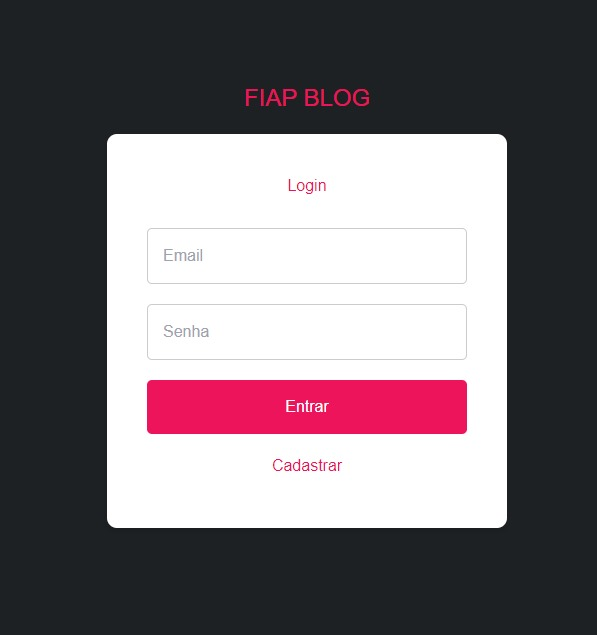
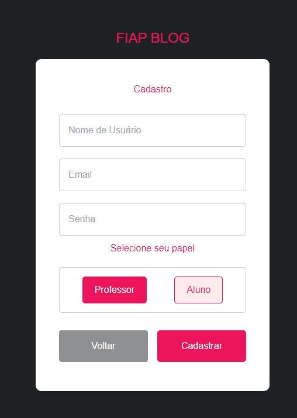
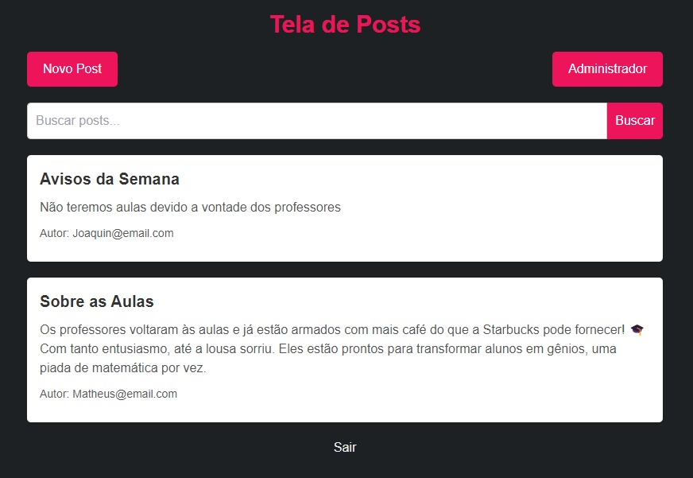
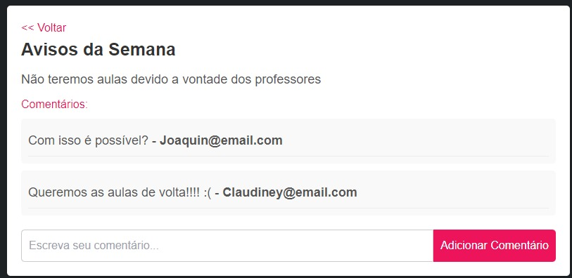
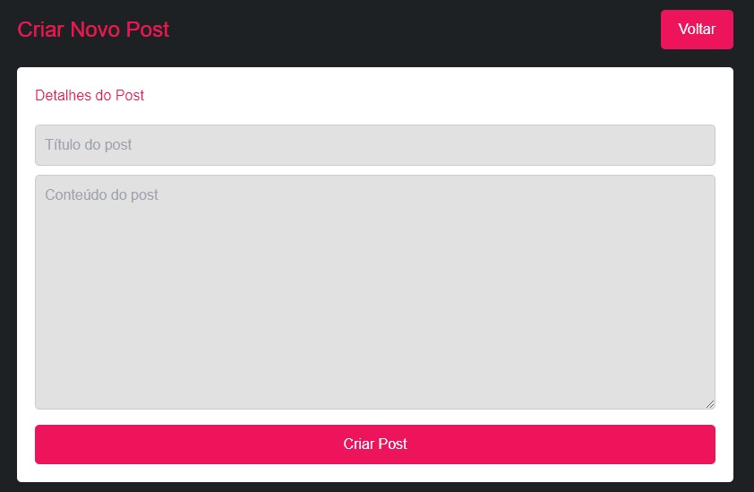
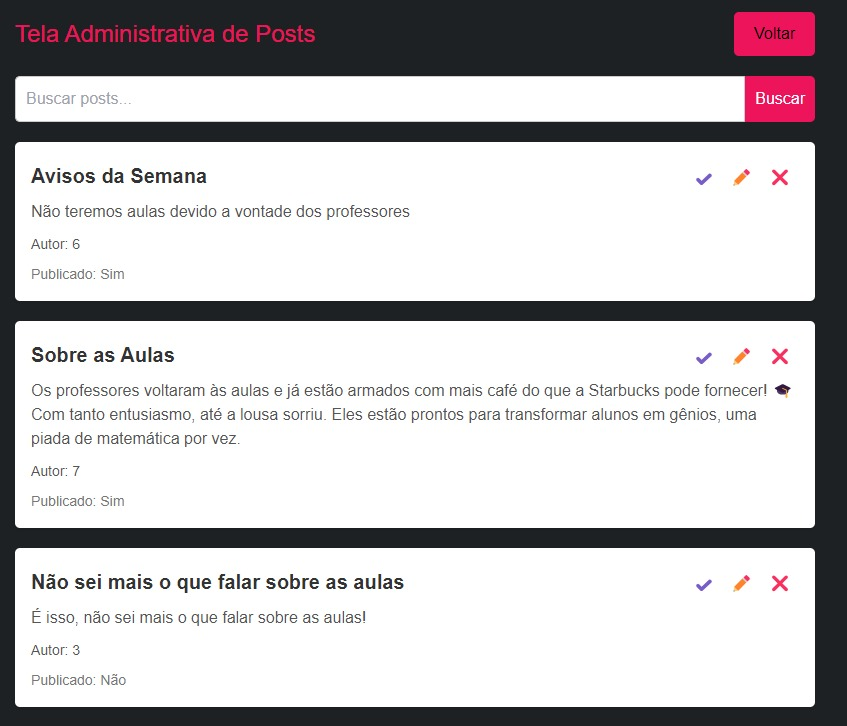

# Documentação Técnica do Front-end

## Sumário
- [Visão Geral](#visão-geral)
- [Setup Inicial](#setup-inicial)
- [Arquitetura da Aplicação](#arquitetura-da-aplicacao)
- [Tecnologias Utilizadas](#tecnologias-utilizadas)
- [Guia de Uso](#guia-de-uso)
   - [Login](#login)
   - [Cadastro](#cadastro)
   - [Visualização de Postagens](#visualizacao-de-postagens)
   - [Detalhes da Postagem](#detalhes-da-postagem)
   - [Gerenciar Postagens](#gerenciar-postagens)
   - [Criar Postagem](#criar-postagem)
  

## Visão Geral

Este repositório contém o front-end da aplicação **FIAP Blog**, desenvolvida em **Next.js** e **React**. A plataforma permite que os usuários se registrem, façam login e interajam com postagens.

## Setup Inicial

Para configurar o ambiente de desenvolvimento, siga os passos abaixo:

### Pré-requisitos

1. **Node.js**: Certifique-se de ter o Node.js instalado na sua máquina. Você pode baixar a versão mais recente do [Node.js](https://nodejs.org/).
2. **Yarn ou npm**: O gerenciamento de pacotes é feito através do Yarn ou npm. Verifique se um deles está instalado.

### Passos para instalação

1. **Clone o repositório**:
   ```bash
   git clone https://github.com/vinecwb/fiap-blog.git
   cd fiap-blog

2. **Instale as dependências:**:
   * Usando npm:
   ```bash 
   npm install
   ```  
   
   * Ou usando Yarn::
   ```bash
   yarn install
   ```

3. **Inicie o servidor de back-end localizado em:**
    ```bash 
    https://github.com/vinecwb/backend-blog-fiap

4. **Inicie o servidor de desenvolvimento:**
    * Usando npm:
   ```bash 
   npm run dev
   ```  

    * Ou usando Yarn::
   ```bash
   yarn dev
   ```

5. **Abra o navegador e acesse:**
   ```bash 
   http://localhost:3001

## Arquitetura da Aplicação
A arquitetura da aplicação é baseada em componentes React, organizados para facilitar a reutilização e manutenção do código. 
Aqui está um resumo da estrutura de pastas:

```bash
project-root/
├── public/                # Arquivos públicos acessíveis diretamente pelo navegador
│   ├── favicon.ico        # Ícone do site
│   └── index.html         # Arquivo HTML principal
├── src/                   # Código-fonte da aplicação
│   ├── components/        # Componentes reutilizáveis da aplicação
│   │   ├── Button.tsx     # Componente de botão
│   │   └── Header.tsx     # Componente de cabeçalho
│   ├── pages/             # Páginas da aplicação
│   │   ├── create/        # Página de criação de posts
│   │   │   ├── index.tsx  # Componente da página de criação de posts
│   │   │   └── create.css # Estilos específicos para a página de criação de posts
│   │   ├── posts/         # Páginas relacionadas a posts
│   │   │   ├── index.tsx  # Componente da página de listagem de posts
│   │   │   └── PostDetail.tsx # Componente da página de detalhes do post
│   │   ├── register/      # Página de registro de usuários
│   │   │   ├── index.tsx  # Componente da página de registro
│   │   │   └── register.css # Estilos específicos para a página de registro
│   │   ├── admin/         # Página de administração
│   │   │   ├── index.tsx  # Componente da página de administração
│   │   │   └── admin.css  # Estilos específicos para a página de administração
│   │   └── _app.tsx       # Componente principal da aplicação
│   ├── styles/            # Arquivos de estilo global
│   │   └── globals.css    # Estilos globais da aplicação
│   ├── utils/             # Utilitários e funções auxiliares
│   │   └── auth.ts        # Funções de autenticação
│   └── index.tsx          # Ponto de entrada principal da aplicação
├── .gitignore             # Arquivos e diretórios a serem ignorados pelo Git
├── package.json           # Dependências e scripts do projeto
├── tsconfig.json          # Configurações do TypeScript
└── README.md              # Documentação do projeto
```

## Tecnologias Utilizadas
* **Next.js**: Framework React para SSR (Server-Side Rendering) e rotas.
* **React**: Biblioteca JavaScript para construção de interfaces de usuário.
* **Tailwind CSS**: Framework CSS para estilização rápida e responsiva.
* **React Toastify**: Biblioteca para notificações em tempo real.

## Guia de Uso

### Login



1. Acesse a página inicial do blog.
2. Preencha os campos de email e senha no formulário de login.
3. Clique no botão "Entrar". Se as credenciais forem válidas, você será redirecionado para a página de postagens.
4. Caso você não tenha um cadastro, pode clicar em "Cadastrar" para ser redirecionado à página de registro.

### Cadastro



1. Preencha os campos solicitador: nome de usuário, email e senha.
2. Selecione seu papel (Professor ou Aluno). Professores poderão gerenciar postagens, enquanto Alunos podem apenas visualizá-las.
3. Clique em "Cadastrar" para finalizar o processo e criar seu perfil.

### Visualização de Postagens



1. Ao logar, você será redirecionado para a página de visualização de postagens.
2. Clique em uma postagem para visualizar mais detalhes.
3. Professores terão dois botões extras:
   * Novo Post: Para criar novas postagens.
   * Administrador: Para gerenciar postagens existentes.

### Detalhes da Postagem



1. Ao clicar em uma postagem, você será levado para a página de detalhes.
2. Nessa página, você pode visualizar o título, conteúdo e autor da postagem, além de ler e adicionar comentários.

### Criar Postagem



1. Clique em "Novo Post" para criar uma nova postagem.
2. Preencha os campos de título e conteúdo.
3. Clique em "Criar Post" para publicar a nova postagem.

### Gerenciar Postagens



1. Ao acessar a área de Administração, você poderá visualizar todas as postagens.
2. Funções disponíveis:
   * Editar: Para modificar uma postagem existente.
   * Aprovar: Para tornar a postagem visível aos usuários.
   * Excluir: Para remover uma postagem.

